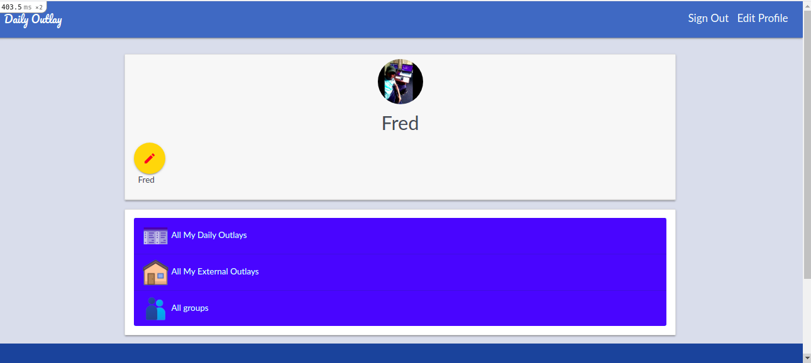

# Group My Daily Outlays

> This is an awesome web application that permits you to registered items bought and their corresponding amount, which can equally be categorized into groups.

The application has the following features:

- User can Register as a new user and login as a registered user.
- The home/profile page is made up of the following links:
    All My Daily Outlays
    All My External Outlays and
    All groups
- Guest users can't access any other page in the app except home, log in and register pages.
- Registered user can create a new group and its corresponding items and amount.
- Logged in user can see all items and groups but can't edit them.
- Logged in user can edit his group only.

## Built With
&nbsp;&nbsp;
&nbsp;&nbsp;
&nbsp;&nbsp;

&nbsp;&nbsp;

## Live Demo

[Group My Expenses](linkhere)

## Getting Started

### Setup & Installation

To get a local copy up and running follow these simple steps.

1. Open a Terminal
2. Clone the repository `git clone https://github.com/FrederickMih/Group-daily-outlay`
3. Move into project path `cd Group-daily-outlay`
4. Install gems required for the project `bundle`
5. Create database `rails db:create`
6. Run database migration `rake db:migrate`
7. Start your server `rails server`
8. Open the app on your browser by visiting the link `http://localhost:3000`

### Testing

RSpec was used for testing. To test, simply follow the instructions below:

1. Open Terminal
2. Confirm that you are in the root directory
3. Run `rspec` in the terminal to run all tests

## Author

👤 **Mih Frederick Mih**

- Github: [@FrederickMih](https://github.com/FrederickMih)
- Twitter: [@MihFrederick](https://twitter.com/MihFrederick)
- Linkedin: [Frederick](https://www.linkedin.com/in/frederick-mih/)

## Acknowledgments

The design information was access from [Snapscan](https://www.behance.net/gallery/19759151/Snapscan-iOs-design-and-branding): Credit goes to [Gregoire Vella](https://www.behance.net/gregoirevella).

## 🤝 Contributing

Contributions, issues, and suggestions are welcome!

## Show your support

Give a ⭐️ if you like this project!

### License

&copy; 2021 Mih Frederick.

Permission is hereby granted, free of charge, to any person obtaining a copy
of this software and associated documentation files (the "Software"), to deal
in the Software without restriction, including without limitation the rights
to use, copy, modify, merge, publish, distribute, sublicense, and/or sell
copies of the Software, and to permit persons to whom the Software is
furnished to do so, subject to the following conditions:

The above copyright notice and this permission notice shall be included in all
copies or substantial portions of the Software.

THE SOFTWARE IS PROVIDED "AS IS", WITHOUT WARRANTY OF ANY KIND, EXPRESS OR
IMPLIED, INCLUDING BUT NOT LIMITED TO THE WARRANTIES OF MERCHANTABILITY,
FITNESS FOR A PARTICULAR PURPOSE AND NONINFRINGEMENT. IN NO EVENT SHALL THE
AUTHORS OR COPYRIGHT HOLDERS BE LIABLE FOR ANY CLAIM, DAMAGES OR OTHER
LIABILITY, WHETHER IN AN ACTION OF CONTRACT, TORT OR OTHERWISE, ARISING FROM,
OUT OF OR IN CONNECTION WITH THE SOFTWARE.